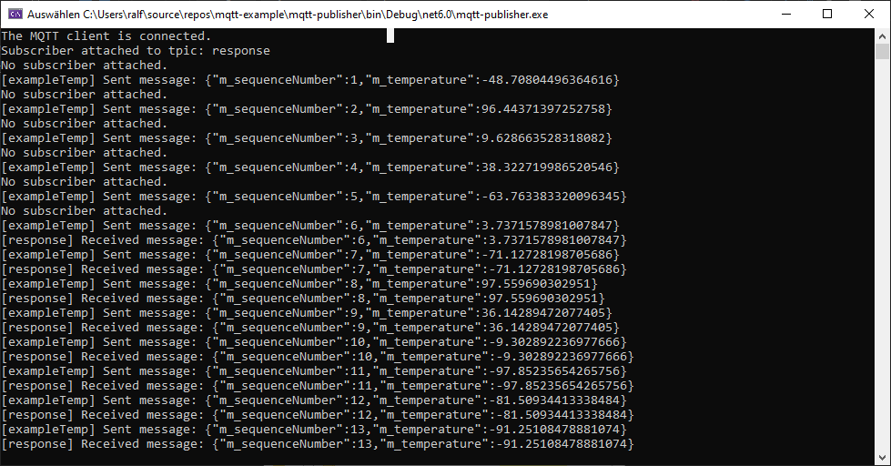
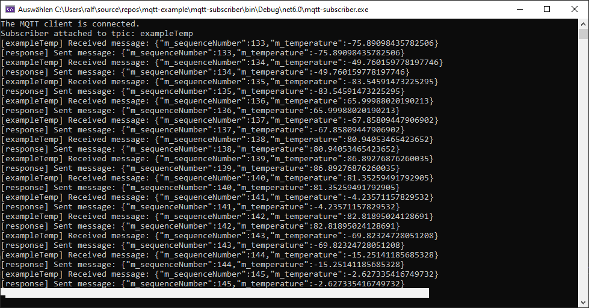

# mqtt-example

## Task-Description
Task: Simulation of a Temperature Sensor - Implement the following three parts of a software in C#

Producer:
Simulate a temperature sensor which creates a random temperature every 500 milliseconds.
The sensor sends the values via MQTT to an MQTT broker.

Consumer:
Implement a software which receives the temperature values and persists them in an appropriate way (e.g. a file).

User interface:
Implement a user interface to visualize the temperature values as a chart.

Notes:
Ensure that the temperature values are displayed in exactly the same order as they were created by the sensor
Ensure that processing a temperature value on the consumer side is finished before the next one arrives
Ensure that the producer recognizes a failure of the sensor (e.g. the sensor does not send values for 5 seconds)


## Model - ExampleMsg
Messages are of the type ExampleMsg containing a temperature reading and a sequence number. The sequencenumber member is basically the Id of an ExampleMsg.

## Mqtt-Client
A wrapper-client for MQTTnet (https://github.com/dotnet/MQTTnet)
Provides functionality for connecting/disconnecting to a broker and sending and subscribing to topics.
Several Services are available:
- IExampleLogger
    A small logger which can log to console. Should be replaced by .netcore logging functionality.
- IExamplePersister
    A service that can write the received example Messages to a logfile. 
    
    ex: logfile.txt 
    ```
        06.11.2022 16:16:21: 06.11.2022 16:16:21
        06.11.2022 16:16:26: {"m_sequenceNumber":1,"m_temperature":94.15508413184793}
        06.11.2022 16:16:27: {"m_sequenceNumber":2,"m_temperature":74.86873894654242}
        06.11.2022 16:16:27: {"m_sequenceNumber":3,"m_temperature":40.26409575280005}
        06.11.2022 16:16:28: {"m_sequenceNumber":4,"m_temperature":49.48893982081599}
        06.11.2022 16:16:28: {"m_sequenceNumber":5,"m_temperature":4.848380298923605}
    ```
- ISensorValidator
    A service that is called once a message has been recieved. Provides information if a timeout has been detected and the last received sequenceNumber.
    If no message was received ever no timeouts are detected.

- IMqttStatusMonitor
    A service to store and retreiving the last 20 received exampleMsg.


## Producer (mqtt-publisher)
Console application in C#
- generates random temperature values
- uses the mqtt-client to publish example messages containing temperature and a sequence number
- can detect timeouts of subscribers where for a given time no response was received
- can detect if a client is slow with processing previous example msg




## Consumer/Subscriber (mqtt-subscriber)
Console application in C#
- subscribes to example messages using the mqtt client
- starts a task to check for timeouts of publisher




## Error handling
### Timeout
MqqtClient/ExampleSensorValidator.cs
Store received time and last received sequence number.

Timeout is detected by comparing last received timestamp against a threshold time in milliseconds. If delta is big enough a timeout is detected.
The publisher requires a confirmation message of the subscriber to confirm a timeout.

### Sync-of publisher
Confirmation message of subscriber to publisher contains the processed sequenceNumber. With this information the publisher can determine that the subscriber is out of sync with processing the last sent message due to several reasons (eg. network issues, delay in logging etc.)


Below is an example where first the publisher (upper console) is stopped which leads to timouts for subscriber (lower console) and then the subscriber is stopped which leads to out of sync messages of publisher and finally to timeout in publisher.


## UserInterface (ExampleUserInterface)
The ExampleUserInterface is a AspNetCore WebApplication (C#) with a AngularJs client side app.

Serverside the SubscriberService is used and a Controller to query the last 20 ExampleMsg (Temperature Readings) is added. The ExampleMsg are sorted by their sequence Number.

The client periodically polls the latest 20 ExampleMsg to display them into a apexchart (x-values: sequenceNumber, y-values the temperature) and into a table below.


## Todos
- Clean up the example webb app
- dependency injection in subscriber and publisher
- eventually find a better solution to return the 20 msgs from subscriber service
- use .net core logger instead of own implementation
- add example unit test
-- to service (mock client/network)
-- to angular app
- add some kind of logic for understanding the sequenceNumber overflow (or at least calculate approximate runtime when it will occur) for subscriber
- instead of magic numbers/ports/servernames use parameters of .net core
- currently subscriber:publisher => 1:1, if multiple subscribers the logic in publisher will break

